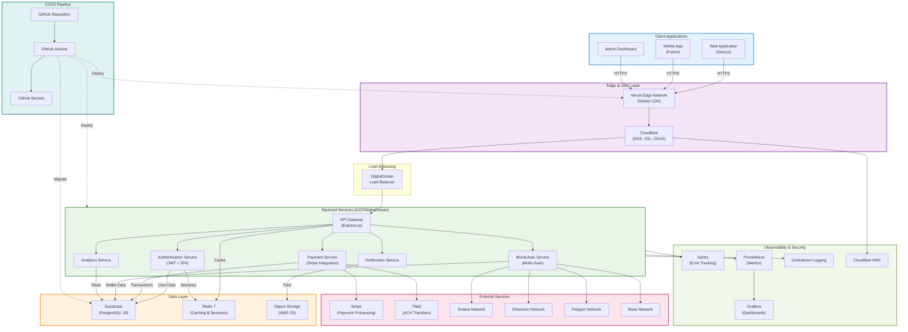
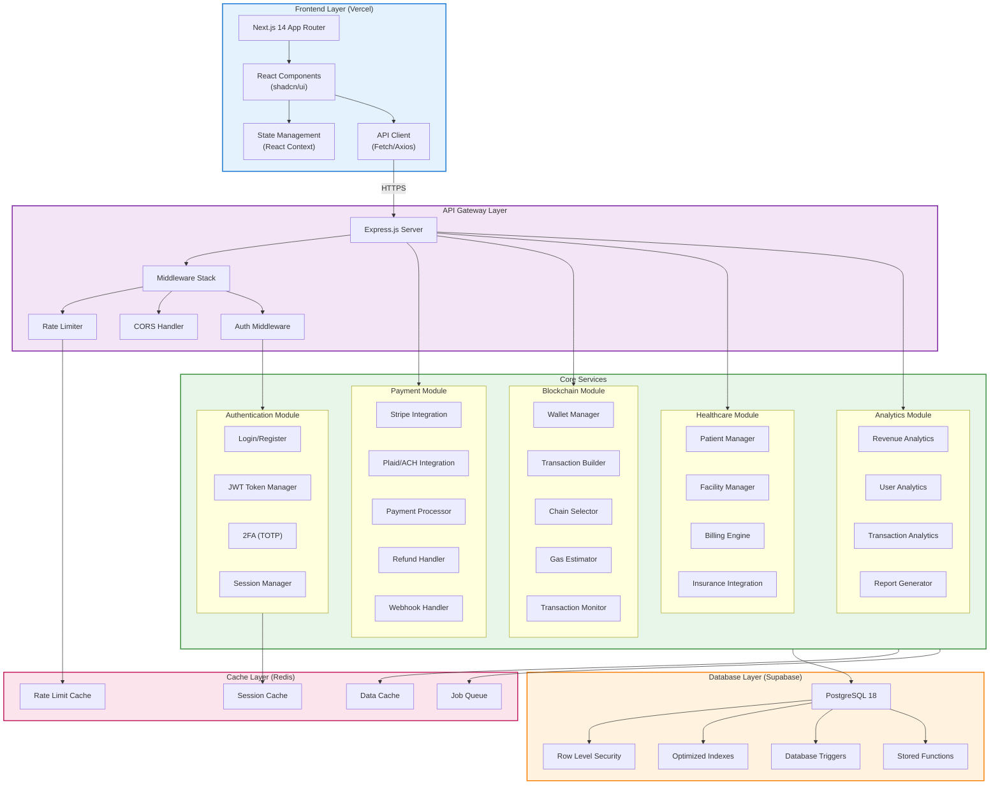
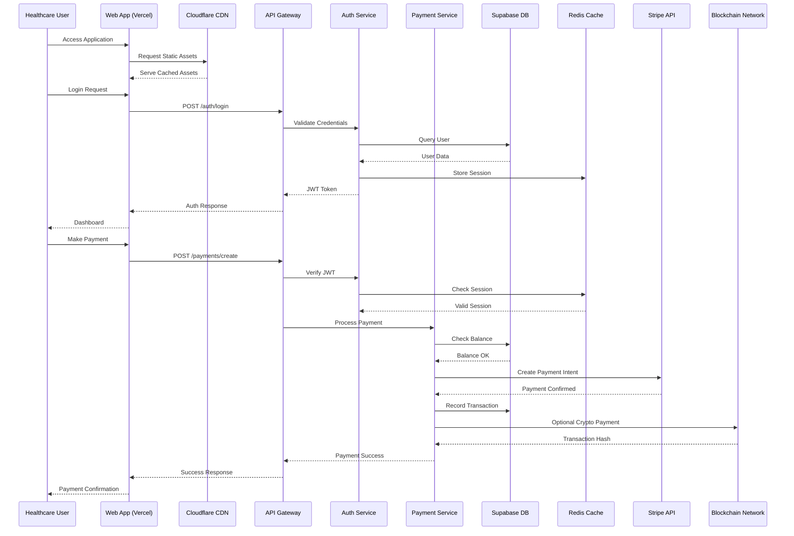
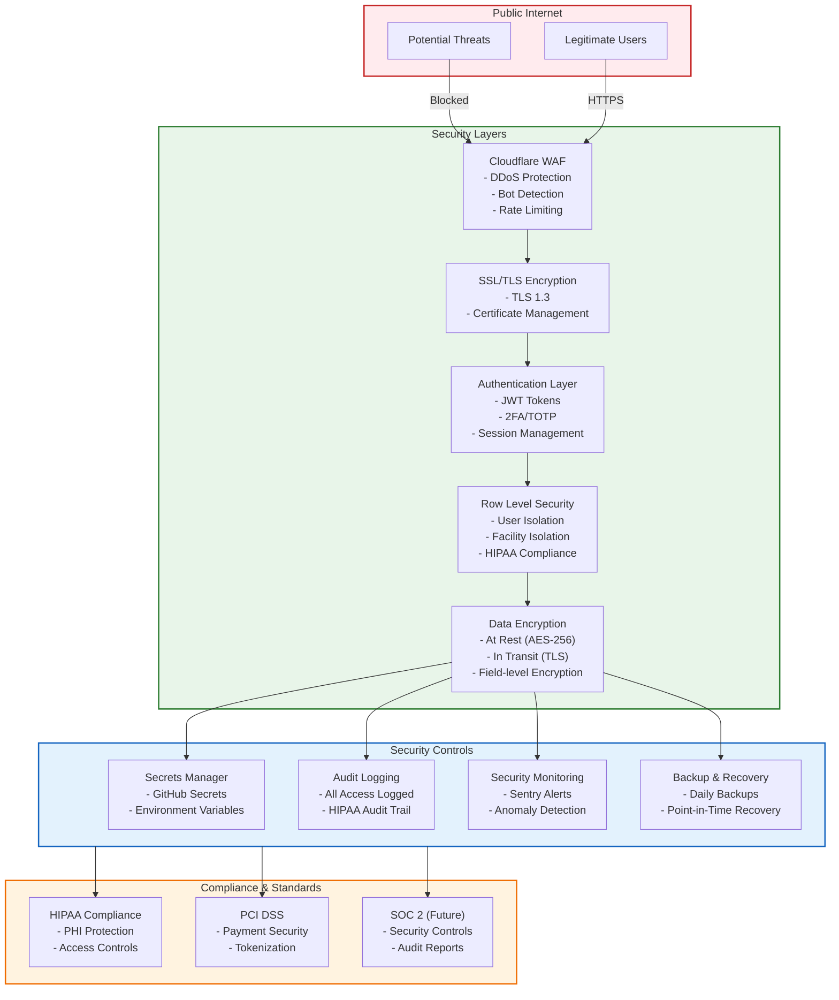
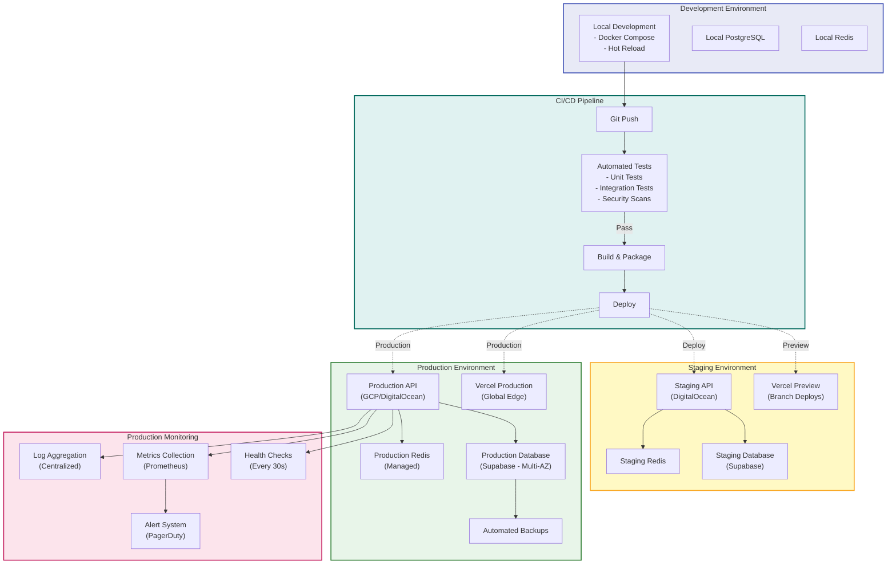
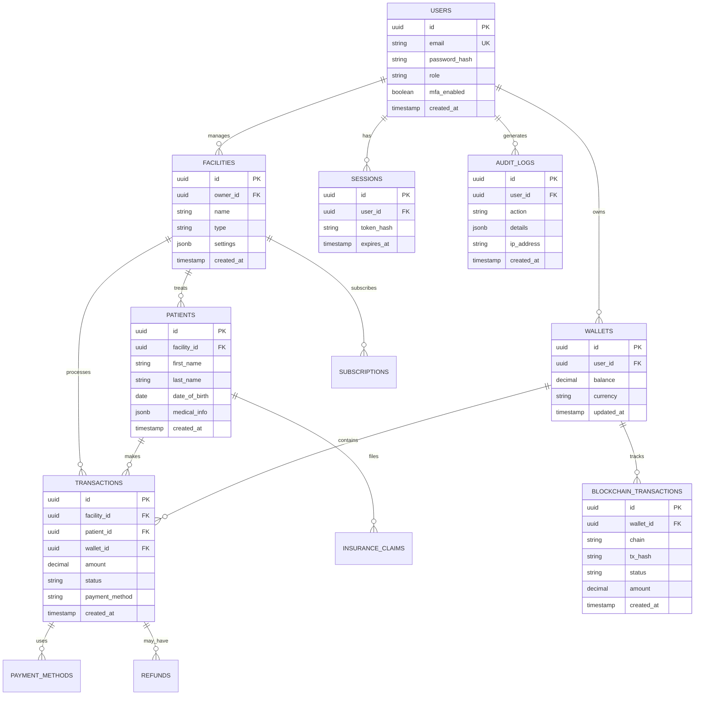
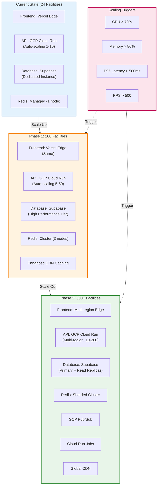

# Advancia Pay Ledger - System Architecture

This document provides comprehensive architecture diagrams for the Advancia Pay Ledger healthcare payment platform.

---

## High-Level Architecture Overview

---

## Detailed Component Architecture

---

## Data Flow Architecture

---

## Security Architecture

---

## Deployment Architecture

---

## Database Schema Architecture

---

## Scaling Strategy

---

## Technology Stack Summary

### Frontend

- **Framework**: Next.js 14 (App Router)
- **UI Library**: React 18
- **Component Library**: shadcn/ui
- **Styling**: TailwindCSS
- **State Management**: React Context
- **Hosting**: Vercel (Global Edge Network)

### Backend

- **Runtime**: Node.js 20
- **Framework**: Express.js
- **Language**: TypeScript
- **API Style**: REST
- **Hosting**: GCP/DigitalOcean

### Database

- **Primary**: PostgreSQL 18 (Supabase)
- **Cache**: Redis 7
- **ORM**: Prisma
- **Migrations**: Prisma Migrate

### Infrastructure

- **CDN**: Cloudflare + Vercel Edge
- **Load Balancer**: DigitalOcean/GCP
- **DNS**: Cloudflare
- **SSL**: Cloudflare + Let's Encrypt

### External Services

- **Payments**: Stripe, Plaid
- **Blockchain**: Solana, Ethereum, Polygon, Base
- **Monitoring**: Sentry, Prometheus, Grafana
- **CI/CD**: GitHub Actions

### Security

- **Authentication**: JWT + 2FA (TOTP)
- **Encryption**: TLS 1.3, AES-256
- **WAF**: Cloudflare
- **Compliance**: HIPAA, PCI DSS

---

## Performance Targets

### API Performance

- P95 Response Time: < 500ms
- P99 Response Time: < 1000ms
- Throughput: > 50 req/sec (current), > 500 req/sec (target)
- Error Rate: < 1%
- Availability: 99.9%

### Database Performance

- Query Time: < 100ms (P95)
- Connection Pool: < 80% utilization
- Cache Hit Rate: > 90%
- Transactions/sec: > 100

### Frontend Performance

- LCP: < 2.5s
- FID: < 100ms
- CLS: < 0.1
- Performance Score: > 90

---

**Last Updated**: February 1, 2026  
**Version**: 1.0.0  
**Maintained By**: DevOps Team
